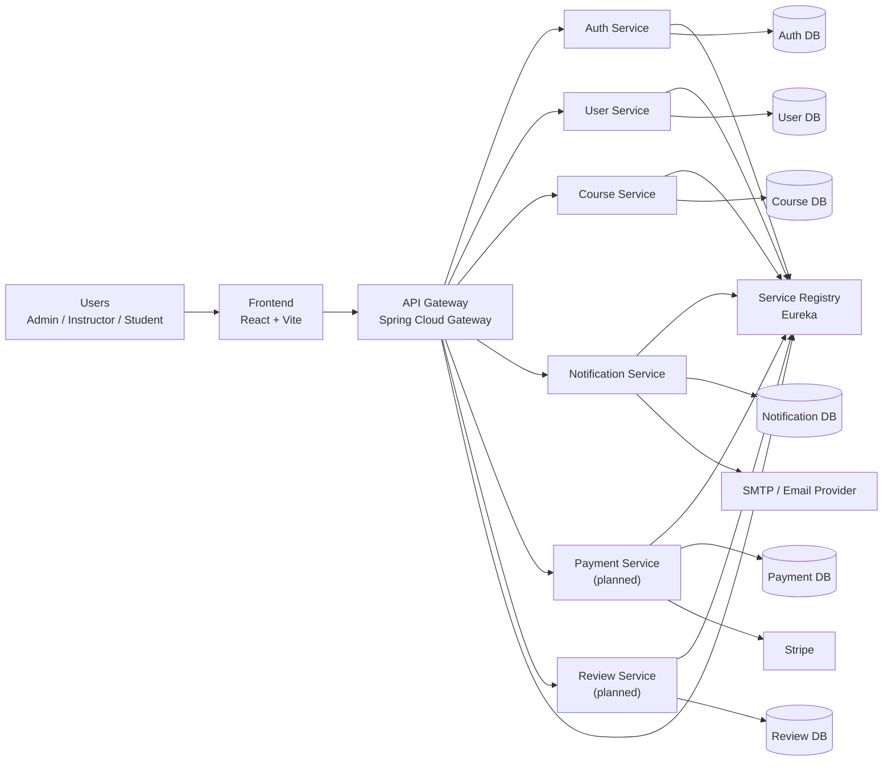

# LMS Platform System Design

## 1. Purpose

This document defines the end-to-end system design for the LMS platform in this repository. It reflects:

- the services already present in the workspace
- the target microservice architecture described in project guidance
- the missing modules and integrations required for a production-ready LMS

The design is written to support development, onboarding, review, and future scaling.

## 2. System Scope

The platform supports:

- user registration, login, token refresh, and role-based access
- learner, instructor, and admin user management
- course creation, publishing, browsing, and enrollment
- notifications for platform events
- future payment and review capabilities
- a React frontend consuming backend APIs through a single API Gateway

Primary user roles:

- `ADMIN`
- `INSTRUCTOR`
- `STUDENT`

## 3. Current Workspace Baseline

Services currently present in the repo:

- `service-registry` on port `8761`
- `api-gateway` on port `8080`
- `auth-service` on port `8086`
- `user-service` on port `8081`
- `course-service` on port `8083`
- `notification-service` on port `8085`
- `lms-frontend` as the UI client

Planned but not yet present in the repo:

- `payment-service`
- `review-service`

Datastores currently provisioned in Docker:

- `auth-db`
- `user-db`
- `course-db`
- `notification-db`

## 4. High-Level Architecture

## 5. Architectural Style

The platform uses a microservice architecture with these principles:

- each service owns its own database
- all external traffic enters through the API Gateway
- service-to-service discovery uses Eureka
- authentication is centralized in `auth-service`
- authorization is enforced first at the gateway and can be reinforced downstream
- business capabilities are split by domain boundaries

This style is appropriate because the LMS has distinct bounded contexts:

- identity and authentication
- user profile and approval management
- course lifecycle and enrollment
- notifications
- payments
- reviews

## 6. Core Components

### 6.1 Frontend

Technology:

- React 18
- Vite
- React Router

Responsibilities:

- login and registration UI
- course catalog and course detail pages
- learner dashboard
- instructor dashboard
- admin management screens
- token storage and authenticated API requests through the gateway

Design notes:

- frontend should never call internal services directly
- all requests should go to `api-gateway`
- access token should be short-lived
- refresh token flow should be handled centrally in the client HTTP layer

### 6.2 API Gateway

Technology:

- Spring Cloud Gateway
- WebFlux
- Eureka Client

Responsibilities:

- single entry point for frontend and external clients
- request routing by path
- JWT validation
- RBAC enforcement
- CORS configuration
- propagation of trusted identity headers to downstream services

Current route model in the repo:

- `/api/auth/**` -> `auth-service`
- `/api/users/**` -> `user-service`
- `/api/courses/**` -> `course-service`
- `/api/payments/**` -> `payment-service` planned route already defined
- `/api/notifications/**` -> `notification-service`
- `/api/reviews/**` -> `review-service` planned route already defined

Recommended gateway extensions:

- request correlation ID
- rate limiting
- structured audit logging
- circuit breakers and retry for selected downstream calls
- standardized error response mapping

### 6.3 Service Registry

Technology:

- Netflix Eureka Server

Responsibilities:

- service registration
- service discovery for gateway and internal calls
- simplified scaling without hardcoded service locations

This is acceptable for local/dev environments. For production, teams often replace or complement it with platform-native discovery in Kubernetes or cloud infrastructure.

## 7. Domain Services

### 7.1 Auth Service

Responsibilities:

- register users
- authenticate credentials
- issue access tokens and refresh tokens
- validate tokens when needed
- manage password hashing
- persist auth accounts and refresh tokens

Owned data:

- auth user identity
- credential hash
- refresh tokens
- auth role snapshot

Key APIs:

- `POST /api/auth/register`
- `POST /api/auth/login`
- `POST /api/auth/refresh`
- `GET /api/auth/validate`

Important design rule:

- auth-service is the source of truth for credentials
- it should not own rich profile data such as course history or instructor metadata

Recommended improvement:

- align auth user IDs with user-service IDs or introduce a reliable identity-link mapping to avoid cross-service ID mismatch

### 7.2 User Service

Responsibilities:

- manage user profiles
- manage approval state
- expose profile lookup and admin user management
- store user-level domain data outside credentials

Owned data:

- user UUID
- email
- full name
- role
- approval state
- created timestamp
- future profile fields like avatar, bio, timezone, phone, etc.

Key APIs:

- `GET /api/users`
- `GET /api/users/{id}`
- `GET /api/users/email/{email}`
- `PUT /api/users/{id}`
- `PUT /api/users/{id}/approve-instructor`

Recommended future APIs:

- `GET /api/users/me`
- `PATCH /api/users/me`
- `GET /api/users/{id}/public-profile`

Design note:

- `GET /me` is strongly recommended to avoid exposing identity coupling between JWT claims and path parameters

### 7.3 Course Service

Responsibilities:

- course creation and editing
- module and lesson management
- publishing workflow
- catalog browsing
- enrollment and course access rules
- progress tracking in future phases

Owned data:

- course metadata
- curriculum structure
- instructor ownership
- publication status
- pricing snapshot or product linkage
- enrollment records
- progress records in later phases

Recommended aggregate model:

- `Course`
- `Section`
- `Lesson`
- `Enrollment`
- `CoursePublication`
- `Category`
- `Tag`

Suggested APIs:

- `POST /api/courses`
- `PUT /api/courses/{courseId}`
- `GET /api/courses`
- `GET /api/courses/{courseId}`
- `POST /api/courses/{courseId}/publish`
- `POST /api/courses/{courseId}/enroll`
- `GET /api/courses/instructor/{instructorId}`
- `GET /api/courses/student/{studentId}/enrollments`

### 7.4 Notification Service

Responsibilities:

- send transactional emails
- persist notification history
- manage notification templates
- handle retry logic for transient failures
- future support for push and in-app notifications

Owned data:

- notification records
- template metadata
- delivery status
- retry attempts
- recipient channels

Trigger examples:

- welcome email after registration
- course enrollment confirmation
- instructor approval notification
- password reset or security event alert

Recommended architecture:

- accept notification commands asynchronously
- queue outbound work
- retry failed sends with backoff

### 7.5 Payment Service (Planned)

Responsibilities:

- create checkout sessions
- receive Stripe webhooks
- persist payment transaction state
- confirm enrollments after successful payment
- support refunds and payment audits

Owned data:

- payment intent status
- transaction history
- order records
- refund records
- Stripe event idempotency tracking

Suggested APIs:

- `POST /api/payments/checkout`
- `POST /api/payments/webhook`
- `GET /api/payments/{paymentId}`
- `POST /api/payments/{paymentId}/refund`

Critical design rule:

- enrollment should become active only after verified payment success or for free courses based on explicit course rules

### 7.6 Review Service (Planned)

Responsibilities:

- course ratings and reviews
- review moderation
- course rating aggregation

Owned data:

- review text
- rating score
- author reference
- course reference
- moderation status

Suggested APIs:

- `POST /api/reviews`
- `GET /api/reviews/course/{courseId}`
- `PUT /api/reviews/{reviewId}`
- `DELETE /api/reviews/{reviewId}`
- `POST /api/reviews/{reviewId}/moderate`

Important constraint:

- only enrolled learners should be allowed to review a course

## 8. Data Ownership and Boundaries

Each service must own only its domain data.

| Service | Owns | Must not own |
| --- | --- | --- |
| Auth Service | passwords, refresh tokens, auth identity | course data, profile history, payments |
| User Service | profile, role view, approval, user metadata | passwords, refresh tokens |
| Course Service | course content, publishing, enrollments | credentials, payment gateway secrets |
| Notification Service | delivery history, templates | business source-of-truth records |
| Payment Service | payment transactions, webhook state | course catalog content |
| Review Service | ratings, reviews, moderation | enrollment source-of-truth |

Design principle:

- services communicate using IDs and events, not shared tables

## 9. Recommended Data Model

### 9.1 Auth Service

Core tables:

- `users`
- `refresh_tokens`

Suggested fields for `users`:

- `id`
- `email`
- `password_hash`
- `role`
- `status`
- `created_at`
- `updated_at`

### 9.2 User Service

Core tables:

- `users`

Suggested fields:

- `id` UUID
- `auth_user_id` or unified identity ID
- `email`
- `full_name`
- `role`
- `is_approved`
- `avatar_url`
- `bio`
- `timezone`
- `created_at`
- `updated_at`

### 9.3 Course Service

Core tables:

- `courses`
- `course_sections`
- `course_lessons`
- `course_categories`
- `course_tags`
- `course_instructors`
- `enrollments`
- `course_progress`

Suggested fields for `courses`:

- `id`
- `title`
- `slug`
- `description`
- `thumbnail_url`
- `price`
- `currency`
- `status` draft/published/archived
- `primary_instructor_id`
- `created_at`
- `updated_at`

### 9.4 Notification Service

Core tables:

- `notifications`
- `notification_templates`
- `notification_attempts`

### 9.5 Payment Service

Core tables:

- `payments`
- `orders`
- `refunds`
- `stripe_events`

### 9.6 Review Service

Core tables:

- `reviews`
- `review_moderation_logs`
- `course_rating_summary`

## 10. Key Request Flows

### 10.1 Registration Flow

1. Client sends `POST /api/auth/register` via gateway.
2. Gateway forwards public auth request to auth-service.
3. Auth-service validates uniqueness and hashes password.
4. Auth-service creates auth user and refresh token.
5. Auth-service publishes `UserRegistered` event or calls user-service to create profile.
6. Notification-service sends welcome message.

Recommended pattern:

- use event-driven profile creation for resilience
- return tokens immediately after successful registration

### 10.2 Login Flow

1. Client submits email and password.
2. Auth-service validates credentials.
3. Access token and refresh token are returned.
4. Frontend stores tokens securely and uses access token for future API calls.

### 10.3 Protected API Flow

1. Client calls gateway with bearer token.
2. Gateway validates JWT.
3. Gateway checks route-level RBAC.
4. Gateway forwards request with trusted headers such as:
   - `X-User-Id`
   - `X-User-Email`
   - `X-User-Role`
   - `X-Correlation-Id`
5. Downstream service executes business logic.

### 10.4 Paid Enrollment Flow

1. Student clicks enroll on paid course.
2. Frontend requests checkout session from payment-service through gateway.
3. Payment-service creates Stripe checkout session.
4. Student completes payment on Stripe.
5. Stripe sends signed webhook to `/api/payments/webhook`.
6. Payment-service verifies signature and marks payment succeeded.
7. Payment-service emits `PaymentCompleted`.
8. Course-service consumes event and creates enrollment.
9. Notification-service sends enrollment confirmation.

### 10.5 Review Submission Flow

1. Student submits review through gateway.
2. Review-service verifies the student is eligible to review.
3. Review is stored with moderation status if needed.
4. Course rating summary is recalculated or updated asynchronously.

## 11. Security Design

### 11.1 Authentication

- JWT access tokens for short-lived access
- refresh tokens stored server-side and rotated when possible
- BCrypt password hashing
- public auth endpoints bypass gateway auth filter

### 11.2 Authorization

Primary enforcement:

- API Gateway RBAC on path and method

Recommended secondary enforcement:

- downstream service authorization for critical operations

Reason:

- gateway-only authorization is convenient, but defense-in-depth is safer for admin, payment, and instructor actions

### 11.3 Secrets

Store outside source control:

- JWT secret
- database passwords
- Stripe secret keys
- SMTP credentials

Production recommendation:

- use a secret manager and rotate secrets regularly

### 11.4 Webhook Security

- Stripe webhook route remains public at gateway
- payment-service must verify Stripe signature
- store processed event IDs for idempotency

### 11.5 Auditability

Audit log important events:

- login success/failure
- role changes
- instructor approval
- course publish/unpublish
- payment confirmation/refund
- review moderation

## 12. Integration and Communication Patterns

### 12.1 Synchronous Calls

Use REST for:

- login and token refresh
- profile fetch/update
- course browse and detail lookup
- payment session creation

### 12.2 Asynchronous Events

Use messaging for:

- `UserRegistered`
- `InstructorApproved`
- `CoursePublished`
- `EnrollmentCreated`
- `PaymentCompleted`
- `PaymentFailed`
- `ReviewCreated`
- `NotificationRequested`

Recommended broker:

- RabbitMQ for simpler team adoption
- Kafka if analytics/event scale becomes a priority

Why events matter:

- lower coupling between services
- cleaner retries
- better support for notification and payment workflows

## 13. Deployment Design

### 13.1 Local Development

Current repo deployment style:

- Docker Compose
- one Postgres container per service
- gateway and services connected through `lms-network`

This is a good dev baseline because it matches microservice boundaries clearly.

### 13.2 Production Deployment

Recommended production platform:

- Kubernetes or managed container platform

Recommended production components:

- ingress/load balancer
- containerized gateway and services
- managed PostgreSQL instances
- Redis for caching and token/session support if needed
- RabbitMQ or Kafka for events
- centralized logs
- metrics and tracing stack

### 13.3 Environment Strategy

Use separate configs for:

- local
- docker
- staging
- production

Each environment should vary:

- datasource URLs
- secret sources
- mail provider config
- Stripe keys
- log verbosity

## 14. Scalability Strategy

### 14.1 Horizontal Scaling

Scale independently based on load profile:

- auth-service for login spikes
- course-service for catalog browsing and enrollments
- notification-service for bursty async delivery

### 14.2 Caching

Recommended cache targets:

- public course catalog pages
- course detail responses
- category/tag lists
- rating summaries

Recommended tech:

- Redis

### 14.3 Database Scaling

Short term:

- single primary Postgres per service

Medium term:

- read replicas for heavy read services like course-service
- indexing around course search, enrollments, and reviews

## 15. Reliability and Resilience

Recommended measures:

- health endpoints for all services
- database readiness checks
- retries only for safe operations
- dead-letter handling for failed async messages
- idempotent payment webhook processing
- timeout budgets for internal calls
- fallback behavior for notification failures

Important rule:

- notification failure should not roll back confirmed payment or confirmed enrollment unless explicitly required

## 16. Observability

Implement:

- structured JSON logs
- correlation IDs propagated from gateway
- Micrometer metrics
- distributed tracing with OpenTelemetry
- dashboards for latency, errors, throughput, and queue depth

Key metrics:

- auth login success/failure rate
- gateway 4xx/5xx rate
- course enrollment throughput
- payment success/failure/refund rate
- notification delivery success rate
- review moderation queue size

## 17. API Design Standards

Recommended conventions:

- use `/api/{domain}` base paths
- prefer DTOs over exposing entities directly
- consistent error shape across all services
- include validation errors with field-level detail
- support pagination for list endpoints
- version APIs when breaking changes are introduced

Suggested standard response metadata for collection APIs:

- `items`
- `page`
- `size`
- `totalElements`
- `totalPages`

## 18. Known Design Gaps From Current State

These are the main gaps between the current repo and the target system:

1. `payment-service` and `review-service` routes exist in gateway config, but service implementations are missing.
2. Notification and course services appear minimally scaffolded and need domain models plus APIs.
3. Gateway currently does most authorization; downstream defense-in-depth is limited.
4. There is a known identity mismatch risk between auth token user IDs and user-service UUID paths.
5. Current CORS config allows everything, which is acceptable for dev but too open for production.
6. Async messaging is not yet in place, so side effects remain more tightly coupled than ideal.
7. DTO and validation standards are inconsistent across services.

## 19. Recommended Implementation Phases

### Phase 1: Identity Hardening

- unify auth/user identity model
- add `GET /api/users/me`
- standardize JWT claims
- add correlation ID and audit logging

### Phase 2: Course Domain Completion

- implement course CRUD
- implement instructor ownership
- implement publish workflow
- implement enrollments
- add catalog filters and pagination

### Phase 3: Payment Integration

- build payment-service
- integrate Stripe checkout and webhook verification
- emit `PaymentCompleted`
- activate enrollment after payment success

### Phase 4: Notification Maturity

- add async queue
- add email templates
- add retries and delivery status tracking

### Phase 5: Review Domain

- build review-service
- enforce enrollment-based eligibility
- compute course rating summaries

### Phase 6: Production Readiness

- observability stack
- rate limiting
- stricter CORS
- secret manager
- staging and production deployment pipelines

## 20. Recommended Target Architecture Summary

The target LMS should operate as:

- a gateway-first microservice platform
- with auth centralized in `auth-service`
- profile and approval in `user-service`
- content and enrollment in `course-service`
- transactional messaging in `notification-service`
- billing in `payment-service`
- learner feedback in `review-service`
- service discovery through Eureka for dev
- per-service databases for clear ownership
- async events for cross-service side effects

This design fits the repo's current direction while giving a safe path toward production scale.

## 21. Next Design Decisions To Lock In

The most important choices to finalize next are:

1. identity model between auth-service and user-service
2. event broker choice: RabbitMQ or Kafka
3. enrollment model: free, paid, or both from day one
4. course content storage strategy for videos and files
5. review moderation rules
6. whether Eureka remains beyond dev or is replaced in production

