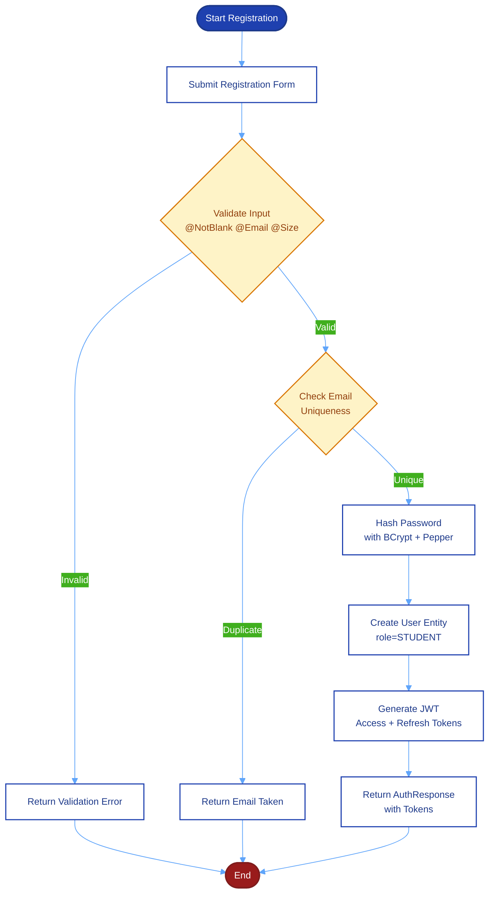
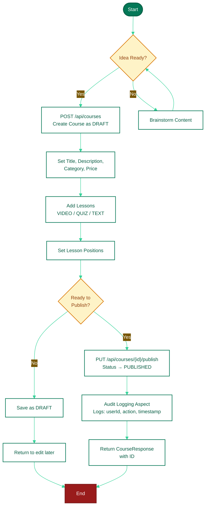
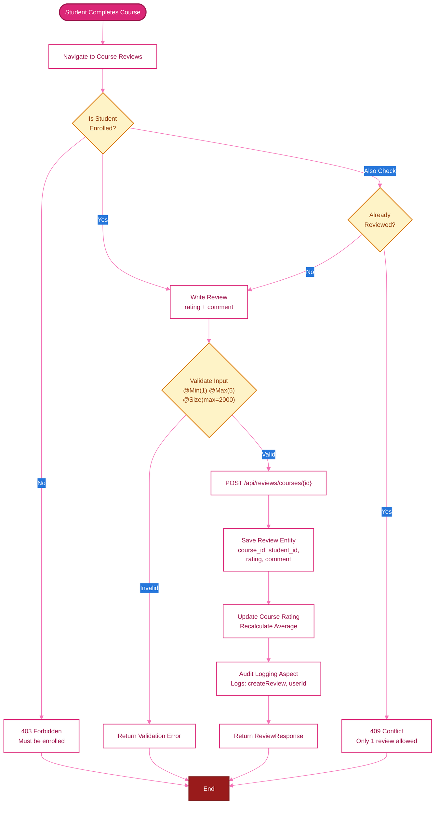

# Activity Diagrams

## 1. User Registration

```mermaid
%%{init: {
  'theme': 'base',
  'themeVariables': {
    'primaryColor': '#1e40af',
    'primaryBorderColor': '#1e3a8a',
    'primaryTextColor': '#ffffff',
    'lineColor': '#60a5fa',
    'tertiaryColor': '#dbeafe',
    'fontSize': '13px'
  }
}}%%
flowchart TB
    classDef start fill:#1e40af,stroke:#1e3a8a,color:#fff,stroke-width:2px
    classDef action fill:#ffffff,stroke:#1e40af,color:#1e3a8a,stroke-width:1.5px
    classDef decision fill:#fef3c7,stroke:#d97706,color:#92400e,stroke-width:1.5px
    classDef endNode fill:#991b1b,stroke:#7f1d1d,color:#fff,stroke-width:2px
    classDef swimlane fill:#dbeafe,stroke:#93c5fd,color:#1e3a8a,stroke-dasharray: 6 3,stroke-width:2px
    classDef note fill:#f0f9ff,stroke:#7dd3fc,color:#0c4a6e,stroke-width:1px

    Start([Start Registration])
    --> SA1[Submit Registration Form]
    --> Validate{Validate Input\n@NotBlank @Email @Size}
    Validate -->|Invalid| ReturnErr[Return Validation Error]
    --> End([End])
    Validate -->|Valid| CheckEmail{Check Email\nUniqueness}
    CheckEmail -->|Duplicate| ReturnDup[Return Email Taken]
    --> End
    CheckEmail -->|Unique| HashPw[Hash Password\nwith BCrypt + Pepper]
    --> CreateUser[Create User Entity\nrole=STUDENT]
    --> GenJWT[Generate JWT\nAccess + Refresh Tokens]
    --> Response[Return AuthResponse\nwith Tokens]
    --> End

    class Start start
    class SA1,ReturnErr,ReturnDup,HashPw,CreateUser,GenJWT,Response action
    class Validate,CheckEmail decision
    class End endNode
```

---

## 2. Course Creation & Publishing

```mermaid
%%{init: {
  'theme': 'base',
  'themeVariables': {
    'primaryColor': '#047857',
    'primaryBorderColor': '#065f46',
    'primaryTextColor': '#ffffff',
    'lineColor': '#34d399',
    'tertiaryColor': '#d1fae5',
    'fontSize': '13px'
  }
}}%%
flowchart TB
    classDef start fill:#047857,stroke:#065f46,color:#fff,stroke-width:2px
    classDef action fill:#ffffff,stroke:#047857,color:#065f46,stroke-width:1.5px
    classDef decision fill:#fef3c7,stroke:#d97706,color:#92400e,stroke-width:1.5px
    classDef endNode fill:#991b1b,stroke:#7f1d1d,color:#fff,stroke-width:2px
    classDef gateway fill:#f3e8ff,stroke:#a78bfa,color:#5b21b6,stroke-width:1.5px
    classDef db fill:#ecfdf5,stroke:#6ee7b7,color:#065f46,stroke-width:1px

    Start([Start]) --> Login{Idea Ready?}

    Login -->|Yes| CreateDraft[POST /api/courses\nCreate Course as DRAFT]
    --> SetMeta[Set Title, Description,\nCategory, Price]
    --> AddLessons[Add Lessons\nVIDEO / QUIZ / TEXT]
    --> Reorder[Set Lesson Positions]
    --> Decision{Ready to\nPublish?}

    Decision -->|No| SaveDraft[Save as DRAFT]
    --> EditLater[Return to edit later]
    --> End

    Decision -->|Yes| Publish["PUT /api/courses/{id}/publish\nStatus → PUBLISHED"]
    --> AuditLog[Audit Logging Aspect\nLogs: userId, action, timestamp]
    --> ReturnResp[Return CourseResponse\nwith ID]
    --> End

    Login -->|No| Brainstorm[Brainstorm Content]
    --> Login

    class Start start
    class CreateDraft,SetMeta,AddLessons,Reorder,SaveDraft,EditLater,Publish,AuditLog,ReturnResp,Brainstorm action
    class Login,Decision decision
    class End endNode
```

---

## 3. Review Submission

```mermaid
%%{init: {
  'theme': 'base',
  'themeVariables': {
    'primaryColor': '#db2777',
    'primaryBorderColor': '#9d174d',
    'primaryTextColor': '#ffffff',
    'lineColor': '#f472b6',
    'tertiaryColor': '#fce7f3',
    'fontSize': '13px'
  }
}}%%
flowchart TB
    classDef start fill:#db2777,stroke:#9d174d,color:#fff,stroke-width:2px
    classDef action fill:#ffffff,stroke:#db2777,color:#9d174d,stroke-width:1.5px
    classDef decision fill:#fef3c7,stroke:#d97706,color:#92400e,stroke-width:1.5px
    classDef endNode fill:#991b1b,stroke:#7f1d1d,color:#fff,stroke-width:2px
    classDef swimlane fill:#fce7f3,stroke:#f9a8d4,color:#9d174d,stroke-dasharray: 6 3
    classDef validation fill:#f0f9ff,stroke:#7dd3fc,color:#0c4a6e,stroke-width:1px

    Start([Student Completes Course])

    --> Navigate[Navigate to Course Reviews]
    --> CheckEnrolled{Is Student\nEnrolled?}
    CheckEnrolled -->|No| Deny[403 Forbidden\nMust be enrolled]
    --> End

    CheckEnrolled -->|Yes| WriteRev[Write Review\nrating + comment]
    --> ValidateRev{"Validate Input\n@Min(1) @Max(5)\n@Size(max=2000)"}
    ValidateRev -->|Invalid| ReturnErr[Return Validation Error]
    --> End

    ValidateRev -->|Valid| SubmitRev["POST /api/reviews/courses/{id}"]
    --> Persist[Save Review Entity\ncourse_id, student_id,\nrating, comment]
    --> UpdateRating[Update Course Rating\nRecalculate Average]
    --> Audit[Audit Logging Aspect\nLogs: createReview, userId]
    --> ReturnResp[Return ReviewResponse]
    --> End

    CheckEnrolled -->|Also Check| DupReview{Already\nReviewed?}
    DupReview -->|Yes| ReturnDup[409 Conflict\nOnly 1 review allowed]
    --> End
    DupReview -->|No| WriteRev

    class Start start
    class Navigate,WriteRev,SubmitRev,Persist,UpdateRating,Audit,ReturnResp,Deny,ReturnErr,ReturnDup action
    class CheckEnrolled,ValidateRev,DupReview decision
    class End endNode
```