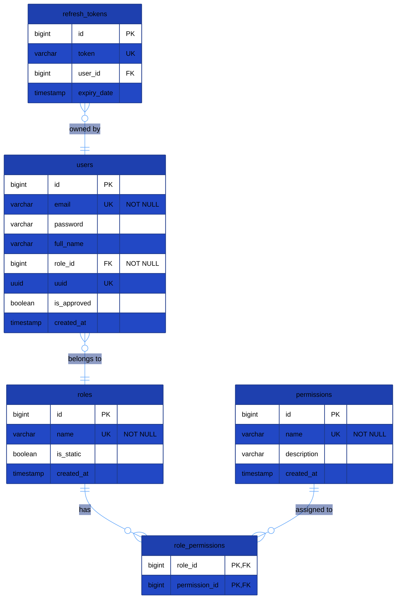
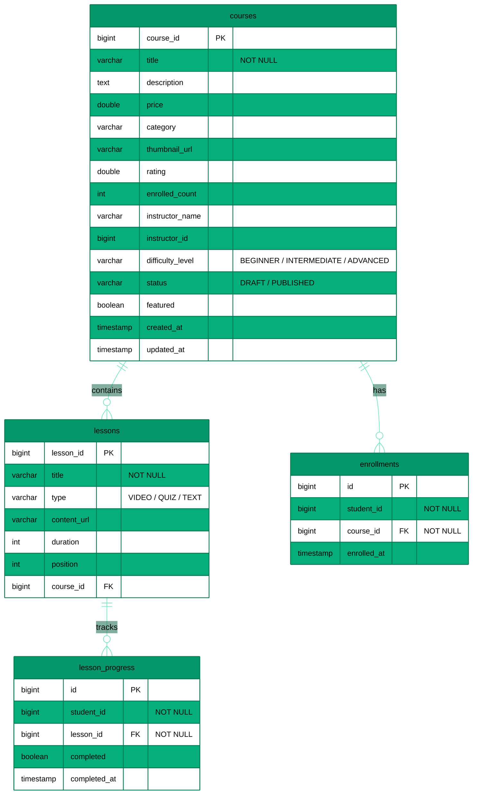
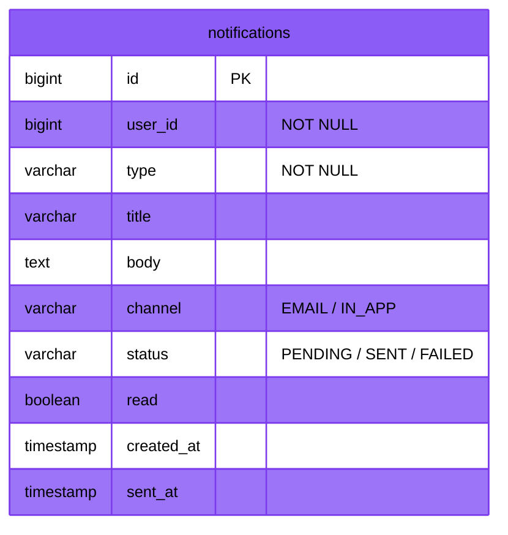
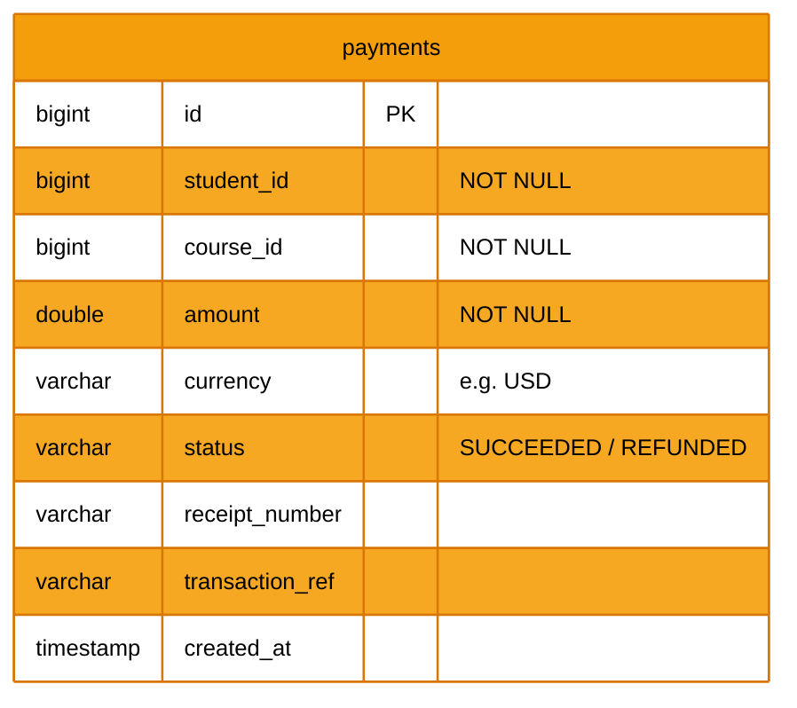
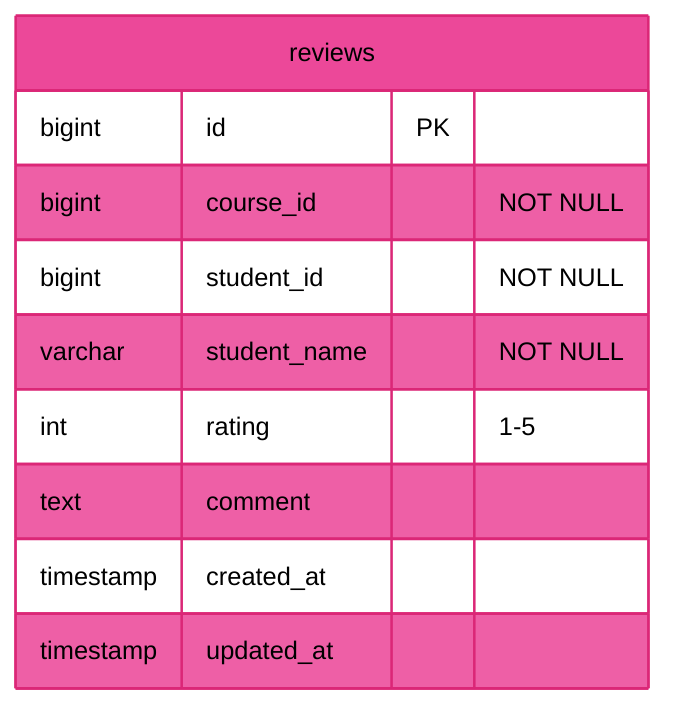

# Entity-Relationship Diagrams

## 1. Shared Database (`lms_db`) — Auth Service & User Service

---

## 2. Course Database (`course_db`) — Course Service

---

## 3. Notification Database (`notification_db`) — Notification Service

---

## 4. Payment Database (`payment_db`) — Payment Service

---

## 5. Review Database (`review_db`) — Review Service

