# LMS Platform — Diagrams Index

## Available Diagrams

| File | Type | Description |
|------|------|-------------|
| [`ERD.md`](./ERD.md) | 🗃️ ERD | 12 tables across 5 databases with entity relationships & color-coded by service |
| [`USE_CASE.md`](./USE_CASE.md) | 👤 Use Case | 7 diagrams: actors (Student, Instructor, Admin, System, Payment Gateway) vs use cases |
| [`ACTIVITY.md`](./ACTIVITY.md) | ⚡ Activity | 4 workflows: Registration, Course Creation, Payment/Enrollment, Review Submission |
| [`SEQUENCE.md`](./SEQUENCE.md) | 🔄 Sequence | 5 business flows: Course Creation, Free Enrollment, Payment, Review, Notification |
| *(below)* | 🔐 Auth/RBAC | 12 authentication & authorization sequence diagrams *(existing)* |

---

# Auth And RBAC Sequence Diagrams

This document captures the current authentication and authorization flow implemented in the repo as of the gateway-first RBAC pass.

## Participants
- `Client`: frontend, Postman, or any external caller
- `API Gateway`: Spring Cloud Gateway with `JwtAuthFilter`
- `Auth Service`: login, register, refresh, validate, JWT issuing
- `User Service`: protected user APIs behind the gateway
- `Auth DB`: auth-service persistence
- `User DB`: user-service persistence

## 1. Student Register Flow

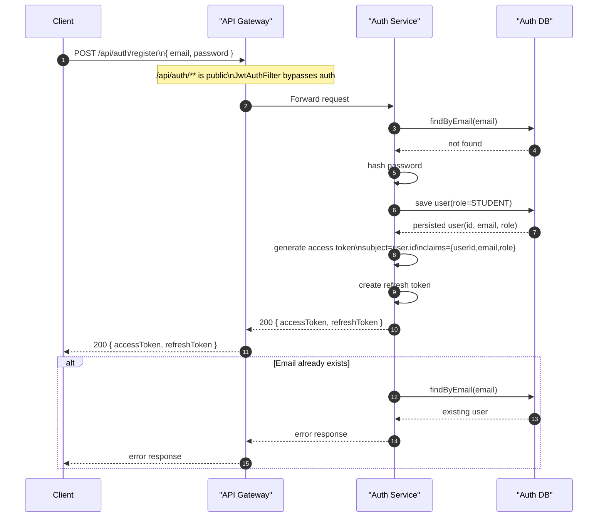

## 2. Login Flow

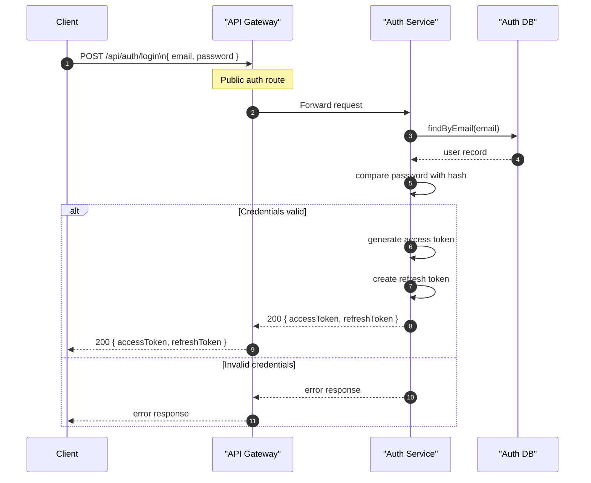

## 3. Refresh Token Flow

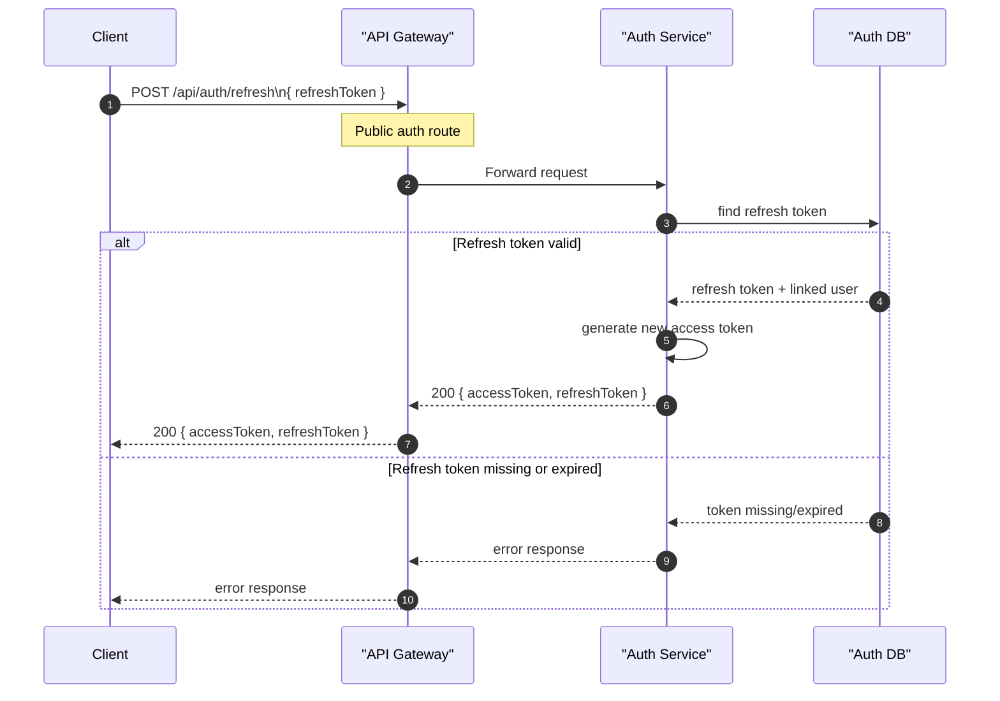

## 4. Token Validation Flow

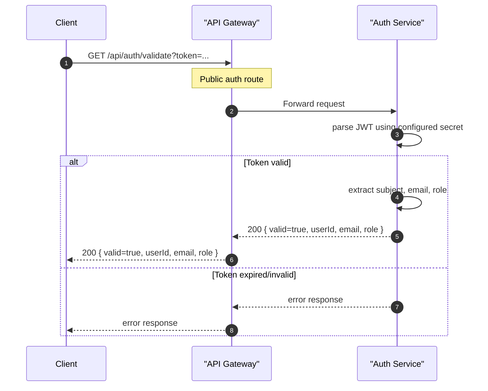

## 5. Protected Request With Successful Gateway Authorization

This is the common path for allowed protected traffic such as:
- `ADMIN -> GET /api/users`
- `ADMIN -> GET /api/users/{id}`
- `ADMIN -> PUT /api/users/{id}`
- `ADMIN -> PUT /api/users/{id}/approve-instructor`
- `STUDENT -> GET /api/users/{selfId}` at the gateway rule level
- `INSTRUCTOR -> PUT /api/users/{selfId}` at the gateway rule level

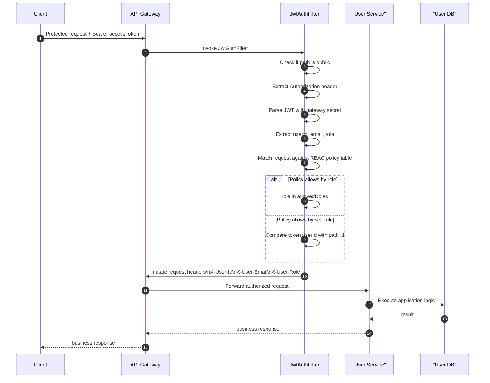

## 6. Protected Request Denied By Missing Token

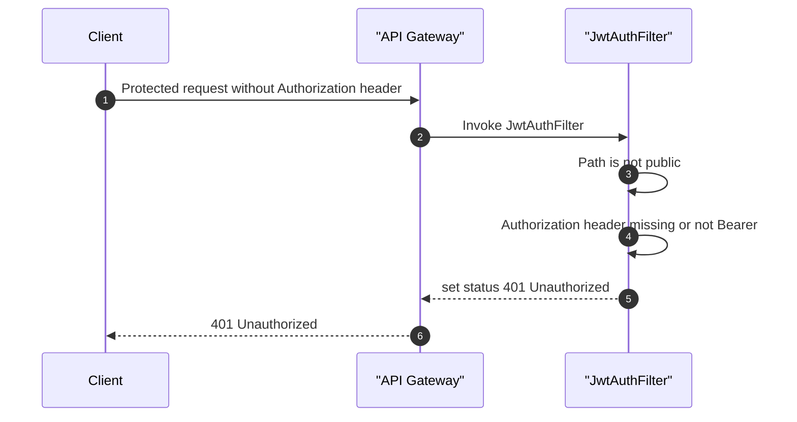

## 7. Protected Request Denied By Invalid Or Tampered Token

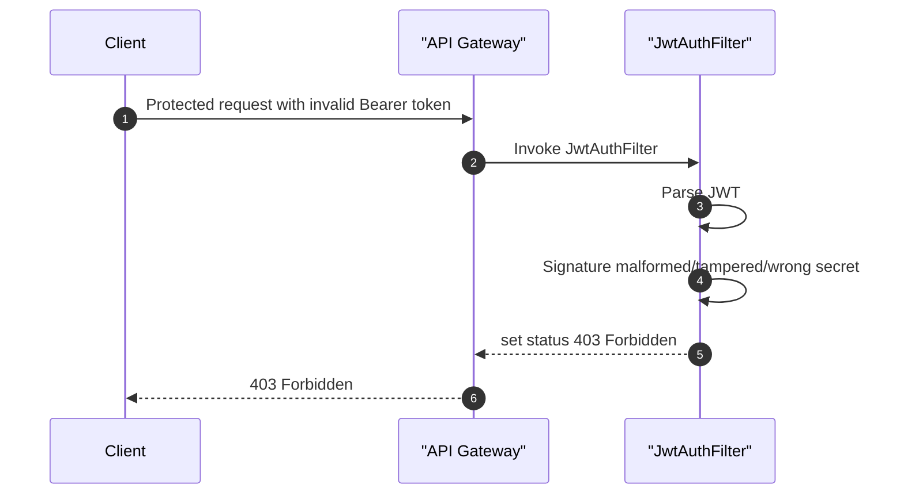

## 8. Protected Request Denied By Expired Token

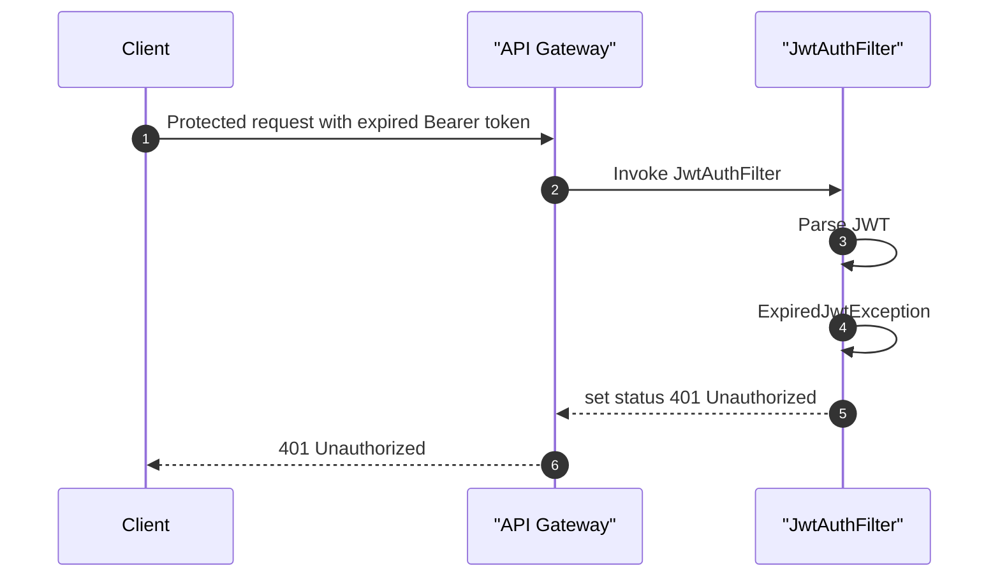

## 9. Protected Request Denied By RBAC Rule

Examples:
- `STUDENT -> GET /api/users`
- `INSTRUCTOR -> GET /api/users/email/{email}`
- `STUDENT -> PUT /api/users/{id}/approve-instructor`
- `INSTRUCTOR -> GET /api/users/{otherId}`

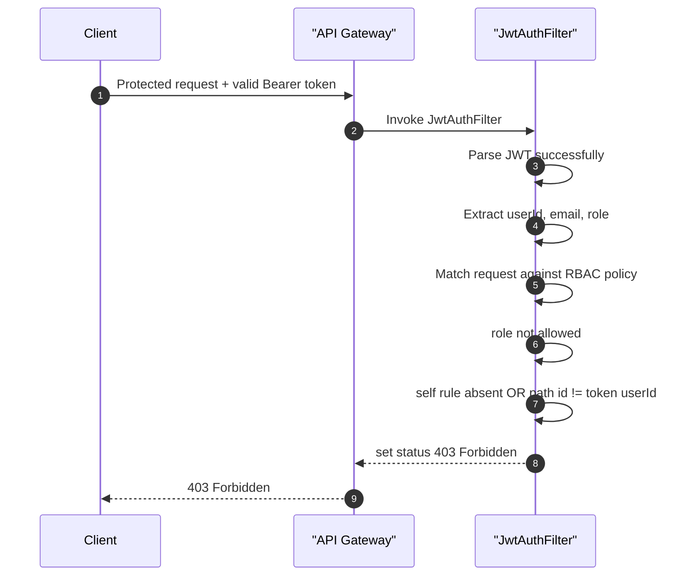

## 10. Admin Access To List And Manage Users

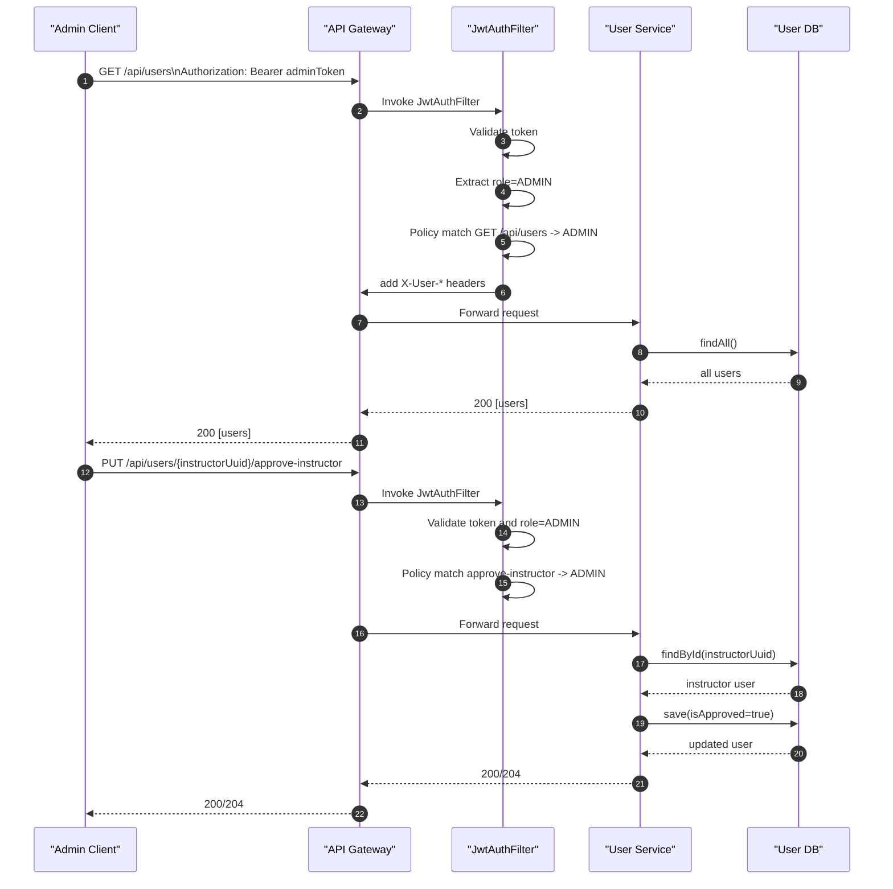

## 11. Student Self Profile Flow And Current ID Mismatch

This diagram shows the current implementation caveat in the repo.

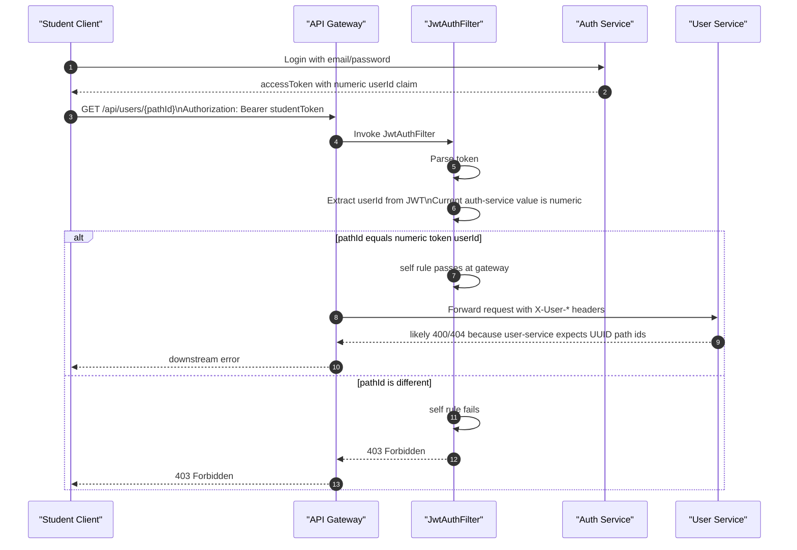

## 12. Authorization Policy Table Used By Gateway

| Method | Path Pattern | Allowed |
| --- | --- | --- |
| `GET` | `/api/users` | `ADMIN` |
| `GET` | `/api/users/email/{email}` | `ADMIN` |
| `GET` | `/api/users/{id}` | `ADMIN` or `self` |
| `PUT` | `/api/users/{id}` | `ADMIN` or `self` |
| `PUT` | `/api/users/{id}/approve-instructor` | `ADMIN` |

## Notes
- Gateway uses local JWT parsing and does not call `/api/auth/validate` during authorization.
- Downstream services currently trust the gateway headers and do not re-parse JWTs.
- Public exceptions currently implemented in the gateway:
  - `/api/auth/**`
  - `GET /api/courses/**`
