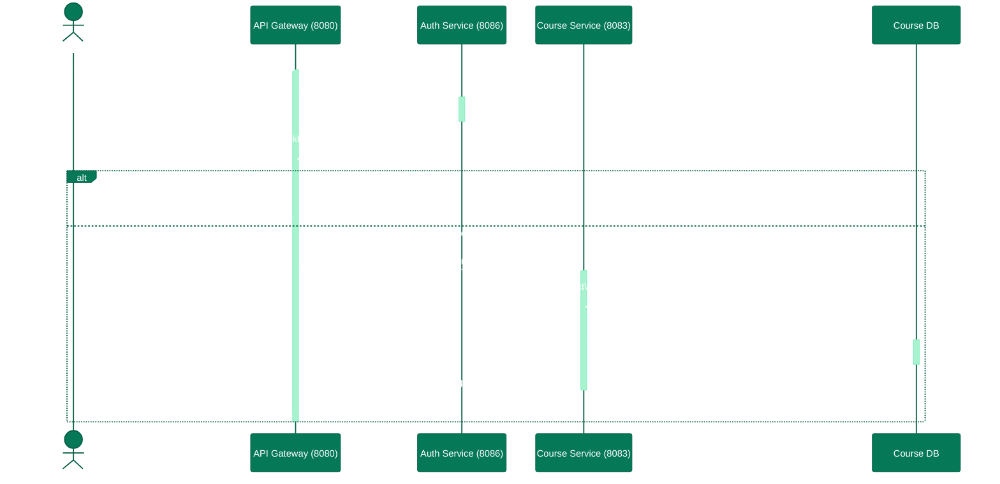
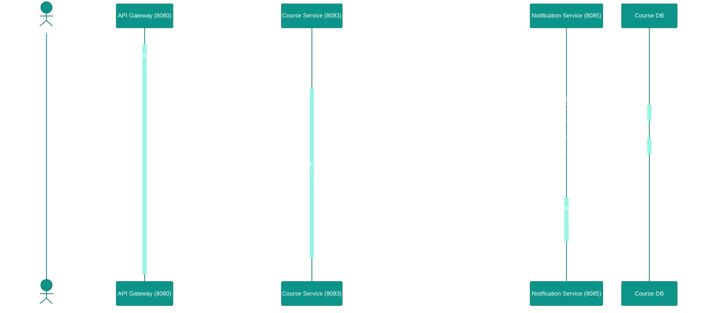
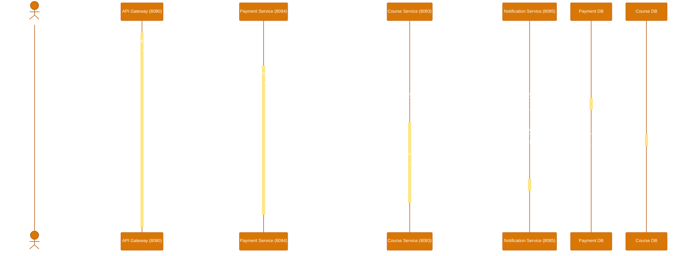
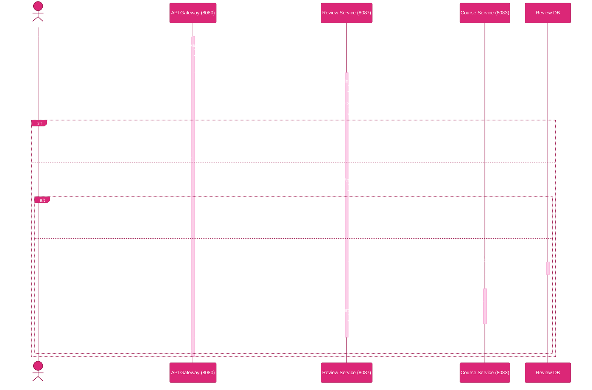

# Sequence Diagrams — Business Process Flows

> Additional sequence diagrams for key LMS business workflows beyond the authentication flows already documented in `README.md`.
> These show inter-service communication patterns including API Gateway routing, Feign client calls, and database persistence.

---

## 1. Course Creation Flow

---

## 2. Student Enrollment Flow (Free Course)

---

## 3. Payment Processing Flow (Paid Course)

---

## 4. Review Submission Flow

