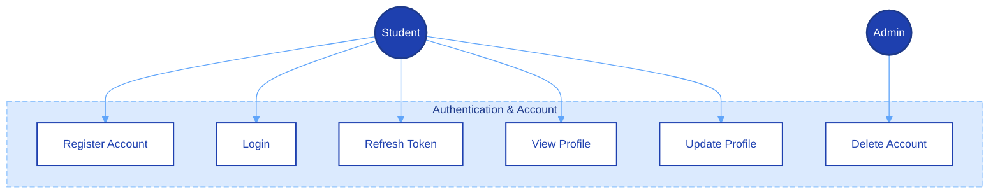
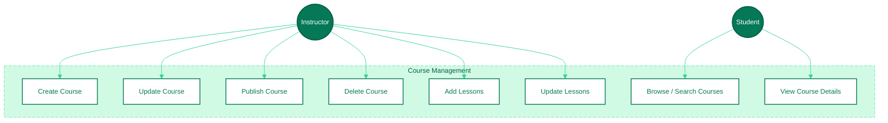
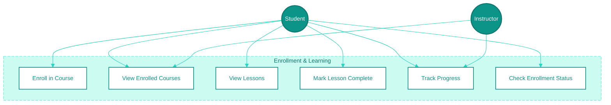
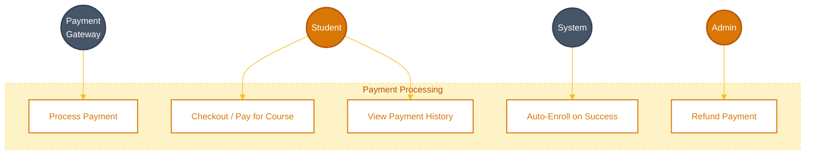
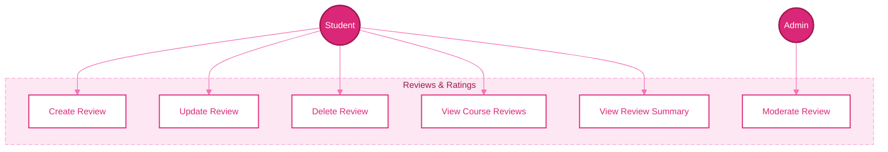
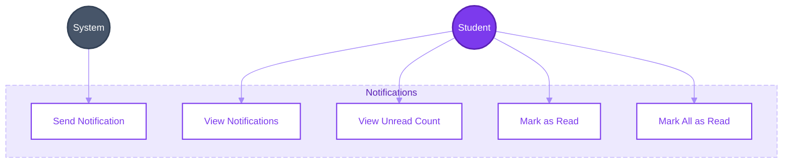

# Use Case Diagrams

## 1. Authentication & User Management

---

## 2. Course Management

---

## 3. Enrollment & Learning

---

## 4. Payments

---

## 5. Reviews

---

## 6. Notifications

---

## 7. Role & Permission Management (Admin)

```mermaid
%%{init: {
  'theme': 'base',
  'themeVariables': {
    'primaryColor': '#dc2626',
    'primaryBorderColor': '#b91c1c',
    'primaryTextColor': '#ffffff',
    'lineColor': '#f87171',
    'tertiaryColor': '#fee2e2',
    'fontSize': '13px'
  }
}}%%
flowchart TB
    classDef actor fill:#dc2626,stroke:#b91c1c,color:#fff,stroke-width:2px
    classDef useCase fill:#ffffff,stroke:#dc2626,color:#dc2626,stroke-width:1.5px
    classDef boundary fill:#fee2e2,stroke:#fca5a5,color:#b91c1c,stroke-dasharray: 6 3

    subgraph Admin_Boundary["Role & Permission Management"]
        UC1["Create Role"]
        UC2["List Roles"]
        UC3["Assign Role to User"]
        UC4["Delete Role"]
        UC5["Create Permission"]
        UC6["Add Permission to Role"]
        UC7["Remove Permission from Role"]
        UC8["Assign Instructor Role"]
        UC9["Approve Instructor"]
    end

    Admin((Admin)) --> UC1
    Admin --> UC2
    Admin --> UC3
    Admin --> UC4
    Admin --> UC5
    Admin --> UC6
    Admin --> UC7
    Admin --> UC8
    Admin --> UC9
    
    class Admin actor
    class UC1,UC2,UC3,UC4,UC5,UC6,UC7,UC8,UC9 useCase
    class Admin_Boundary boundary
```

